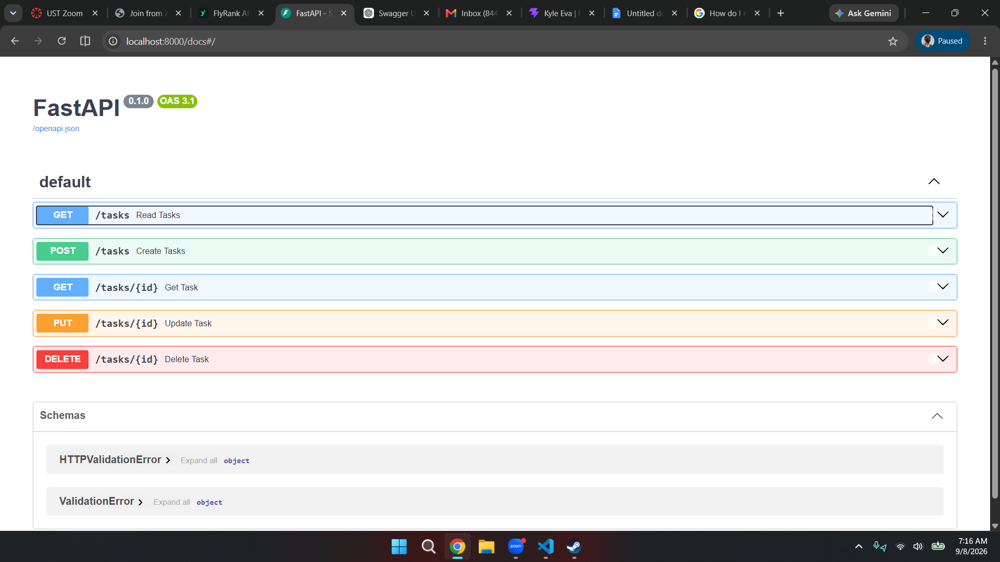
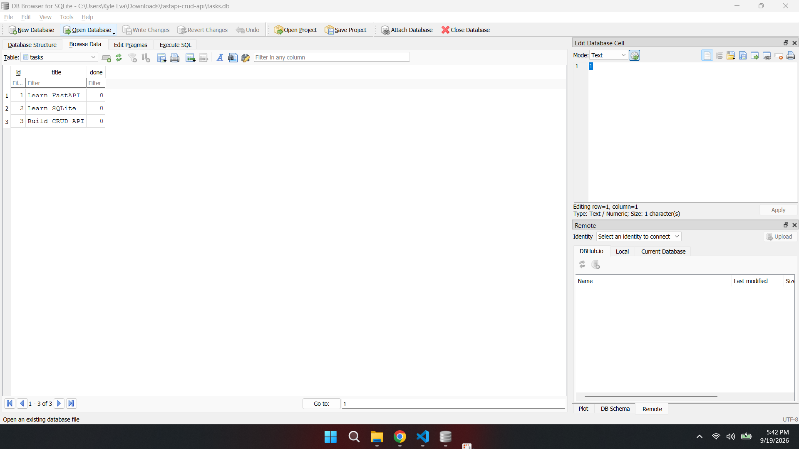

# Task CRUD API

A simple REST API for managing tasks, built with **Python** and **FastAPI**.

The API provides full CRUD (Create, Read, Update, Delete) functionality for tasks and includes automatically generated interactive API documentation through Swagger UI.

## Features

- Create a task
- Retrieve all tasks
- Retrieve a specific task
- Update a task
- Delete a task
- Interactive Swagger UI documentation

## Technologies

- Python
- FastAPI
- Uvicorn
- Pydantic
- SQLite

## Installation

### 1. Clone the repository

Clone this repository to your local machine using Git:

```bash
git clone https://github.com/your-username/your-repository.git
```

### 2. Install the dependencies

```bash
pip install -r requirements.txt
```

### 3. Running the API

Start the FastAPI development server with:

```bash
uvicorn main:app --reload
```

The API will be available at:

```text
http://localhost:8000
```

### 4. API Documentation

FastAPI automatically generates interactive Swagger UI documentation.

Open:

```text
http://localhost:8000/docs
```

### Git Workflow

If you are setting up this project from scratch, initialize Git and push the project to GitHub:

```bash
git init
git add .
git commit -m "Initial commit"
git branch -M main
git remote add origin https://github.com/your-username/your-repository.git
git push -u origin main
```

From Swagger UI, you can use **Try it out** to send requests to the API without using `curl`.

## Endpoints

| Method   | Endpoint      | Description              |
| -------- | ------------- | ------------------------ |
| `POST`   | `/tasks`      | Create a new task        |
| `GET`    | `/tasks`      | Retrieve all tasks       |
| `GET`    | `/tasks/{id}` | Retrieve a specific task |
| `PUT`    | `/tasks/{id}` | Update a task            |
| `DELETE` | `/tasks/{id}` | Delete a task            |

## Example Request

### Create a Task

```http
POST /tasks
```

Example request body:

```json
{
  "title": "Learn FastAPI",
  "done": false
}
```

### Update a Task

```http
PUT /tasks/{id}
```

Example request body:

```json
{
  "title": "Learn FastAPI CRUD",
  "done": true
}
```

## Example `curl -i` Output

The following is an example of testing an endpoint using `curl`:

```bash
curl.exe -i -X GET "http://localhost:8000/tasks"
```

Example response:

```text
HTTP/1.1 200 OK
date: Mon, 07 Sep 2026 23:04:06 GMT
server: uvicorn
content-length: 139
content-type: application/json

{"tasks":[{"id":1,"title":"Do some chores","done":true},{"id":2,"title":"Walk the dog","done":true},{"id":3,"title":"Study","done":false}]}
```

## Swagger UI Screenshot

Swagger UI can be accessed at:

```text
http://localhost:8000/docs
```

Screenshot of the API documentation:



## CRUD Verification

The complete CRUD cycle was tested using Swagger UI:

1. **Create** — created a new task using `POST /tasks`
2. **Read** — retrieved the task using `GET /tasks` or `GET /tasks/{id}`
3. **Update** — modified the task using `PUT /tasks/{id}`
4. **Delete** — removed the task using `DELETE /tasks/{id}`

The API successfully exposes all required CRUD operations through Swagger UI.

## SQLite Database

The API uses **SQLite** to persist task data in a local `tasks.db` database file.

SQLite was chosen because:

- The database is stored in a single file.
- No separate database server or setup is required.
- Data persists across API restarts.
- The database is simple to inspect and modify using DB Browser for SQLite.

### Database File

The database file is:

```text
tasks.db
```

It is created automatically when the application starts. The application also creates the tasks table and seeds it with three example tasks when the database contains no tasks.

This means a fresh clone does not require any manual database setup. Running the documented command is enough to create the database and start the API.

### DB Browser for SQLite

The tasks.db file can be opened in DB Browser for SQLite to view the database structure, browse task records, and execute SQL queries manually.



### Stage 4: SQLite Exploration

One SQL query executed manually in DB Browser for SQLite was:

```sql
UPDATE tasks
SET done = 1
WHERE id = 6;
```

Execution result:

```text
Execution finished without errors.

Result: query executed successfully. Took 0ms, 1 rows affected

At line 1:

UPDATE tasks
SET done = 1
WHERE id = 6;
```

The query executed successfully and affected 1 row, marking task ID 6 as completed. The change was immediately reflected by the API without restarting the server.
